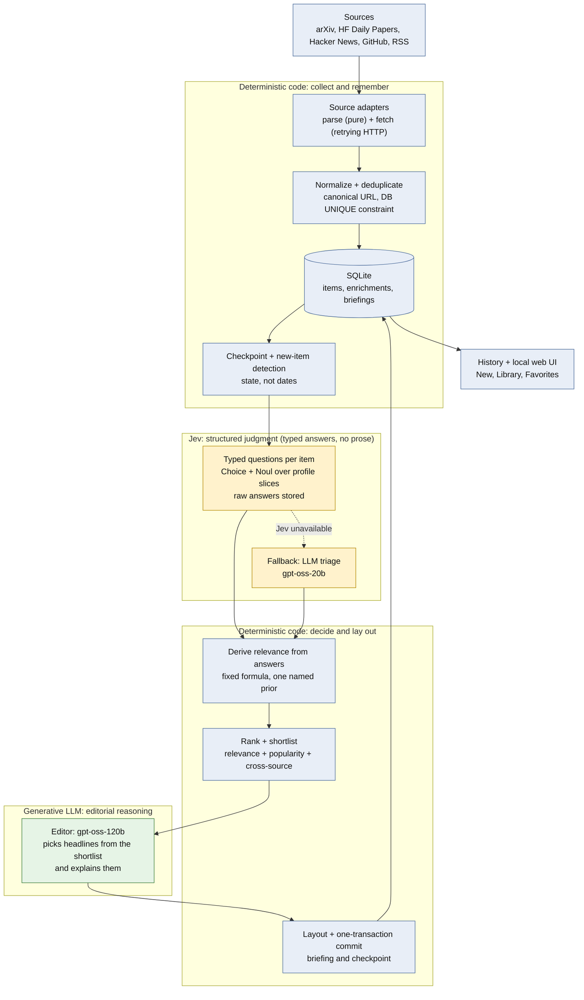

# PIA: Personal Intelligence Agent

A local tool that answers one question, **"What important things have happened since I last checked?"**, by triaging new
papers, posts and repositories against your own interest profile and writing you a short briefing.

> **Status: a personal, single-reader project, published to be read and learned from.** It works and is well tested
> (741 tests), but it is built around one person's workflow, developed on Windows, and not a product for arbitrary users.
> See [Limitations](#limitations).

## The problem

A handful of sources (arXiv, Hugging Face Daily Papers, Hacker News, GitHub, a few blogs) produce a couple of hundred
items a week. Most are irrelevant to any given reader, and a fixed "top N" list neither knows what you have already seen nor
how long you were away.

## Why PIA exists

Two reasons. First, the practical one: a briefing that contains only what is **new to you**, sized by how long you were
away (about one headline after a day, about fifteen after ten days), and personalised by an interest profile you write.

Second, an engineering one: PIA is a worked example of **model specialisation** inside a deterministic pipeline. A cheap
structured "decision model" (Jev) judges every item against typed questions; deterministic code combines the answers and
ranks; only a short list reaches a stronger generative model (Groq-hosted `gpt-oss-120b`) that writes the editorial. The
design decisions, alternatives and measurements are written down in [docs/design.md](docs/design.md).

## Architecture



Blue is **deterministic code** (exact, testable, no model involved), yellow is **Jev structured judgment** (typed answers,
never prose), green is **generative LLM reasoning** (used only where writing and comparison are the job).

## Pipeline

1. **Collect.** One adapter per source turns a response into validated items. Each adapter has a pure `parse_*` half and a
   thin `fetch` half, and every request goes through one retrying HTTP layer.
2. **Normalize and deduplicate.** URLs are canonicalised; identity is enforced by a database `UNIQUE` constraint, so a paper
   seen by three sources is stored once and its popularity signals are merged.
3. **Checkpoint and new-item detection.** "New" is **state** (an item that has not yet been part of a briefing), never a date
   comparison, so something published last week that PIA only found today still counts. The checkpoint is the last saved
   briefing and moves in the same transaction that saves it.
4. **Stage 1: Jev triage.** Each item is judged by typed questions against your profile. Raw answers are stored.
5. **Deterministic ranking.** Code turns the answers into a relevance number and ranks by relevance, per-source popularity
   percentile and a cross-source boost. Nothing here is a model call.
6. **Stage 2: LLM editor.** A stronger model reads the shortlist side by side, picks the developments that truly matter
   (at most the budget, fewer if little happened) and explains them using only the text provided.
7. **Briefing and history.** Layout is done by code, and the briefing is saved to SQLite and shown in the terminal or the local web UI.

## Jev and the LLM: model specialisation

| | Deterministic code | **Jev** (Stage 1) | **Groq LLM** (Stage 2) |
|---|---|---|---|
| Job | fetch, dedup, "what is new", ranking, budget, layout | judge *every* new item against your profile | choose headlines from a shortlist and explain them |
| Output | exact values | typed answers: probabilities, never prose | generated text |
| Volume | everything | every new item (about 150 to 200 per check) | about 15 to 35 shortlisted items |
| Why this tool | must be exact and testable | cheap, fast, structured, inspectable, decomposable | comparison across items and writing are generative jobs |

Jev is used because narrow, typed, per-item questions are cheap to run on everything, produce answers that code can combine
and audit, and keep raw answers so the formula can change without new calls. The stronger LLM is used *later*, on a short
list, because choosing among candidates and writing about them is what generative models are for. **This is a division of
labour, not a claim that Jev is more accurate than a larger model**: the evaluation below did not show that. Details in
[docs/jev.md](docs/jev.md).

## Main capabilities

- Adaptive briefing size that scales with time away; only items new to you.
- Profile-driven triage, with a TOML profile you edit and a per-item audit trail of which question drove each score.
- Crash-safe, idempotent collection: failed sources catch up later, poison items are isolated, nothing is committed
  unless triage succeeded. Fault-injection tests break sources and the LLM at random and check database invariants.
- Local web UI over the same SQLite file, with search, filters and favorites.
- Read-only inspection commands that open the database in SQLite's read-only mode.
- No invented summaries: items with no source text get a bare link, not a generated blurb.
- A frozen, pre-registered evaluation methodology and tooling ([Evaluation](#evaluation)).

## Supported sources

| Source | What is fetched | Pre-filter (in `config/sources.toml`) |
|---|---|---|
| arXiv | newest papers in chosen categories (capped, so a sample rather than a complete feed) | categories, `max_results` |
| Hugging Face Daily Papers | community-curated ML papers | `min_upvotes` |
| Hacker News | stories via the Algolia API | `min_points` |
| GitHub | repositories *created* in the window that match a query | `query`, `min_stars` |
| RSS / Atom | any feed you add; Quanta, DeepMind, OpenAI and the Hugging Face blog are preconfigured | none |

PIA calls only these APIs and feeds. It does not fetch arbitrary web pages (see [Limitations](#limitations)).

## Quickstart

You need Python 3.11+ and a free [Groq](https://console.groq.com) API key. PIA is developed and tested on **Windows 11**;
the Python code has no Windows-specific dependencies apart from the optional `.bat` launchers and the one-key labelling
screen, but macOS and Linux are untested.

```bash
git clone <this repository> pia
cd pia
python -m venv .venv
# Windows:        .venv\Scripts\activate
# macOS / Linux:  source .venv/bin/activate
pip install -e ".[web]"          # use ".[dev]" instead if you want to run the tests
```

Install **editable** (`-e`): PIA finds its `config/` and `data/` folders relative to the source tree.

Configure keys (see [Configuration](#configuration)):

```bash
cp .env.example .env             # Windows: copy .env.example .env
# then edit .env and set GROQ_API_KEY
pia doctor --online              # checks Python, keys, config, database and each source; never prints a key
```

Run a first check: fetch, triage, write and save a briefing.

```bash
pia                              # Windows: double-click run-pia.bat to keep the window open
pia show                         # re-read it
pia web --open                   # the local web UI
```

The first run takes a few minutes because Groq's free tier rate-limits the first batch; PIA waits and retries.

**No keys, no network? Try the web UI on synthetic data:**

```bash
python examples/make_demo_db.py  # writes data/demo.db: invented items, a scripted stand-in for the LLM
pia --db data/demo.db web --open
```

The demo runs PIA's real pipeline end to end; only the sources and the model are replaced, so its categories and
explanations are meaningless.

**Optional: Jev.** Copy `config/interests.example.toml` to `config/interests.toml`, write your own profile, and add
`TYPESAFE_API_KEY` to `.env`. With both present, `--triage auto` uses Jev; otherwise PIA uses the Groq LLM triage.

## Configuration

**Secrets** live in `.env` (or real environment variables, which take precedence). `.env.example` documents every setting:

| Variable | Needed for | Notes |
|---|---|---|
| `GROQ_API_KEY` | every briefing (editor, and LLM triage) | required |
| `TYPESAFE_API_KEY` | Jev triage | optional; `JEV_API_KEY` is accepted as an alias |
| `JEV_MODEL` | pinning a Jev version | optional; default is the alias `jev-latest`, which moves with releases |
| `PIA_TRIAGE` | choosing Stage 1 | `auto` (default), `jev` (strict) or `llm`; same as `--triage` |

`.env` and `.env.txt` (in case Notepad added the extension) are git-ignored, and PIA never prints a key.

**Sources** live in `config/sources.toml`. Adding a blog or feed needs no code:

```toml
[[source]]
type = "rss"
name = "my_blog"
url = "https://example.com/feed.xml"
```

Other source types (`arxiv`, `hf_papers`, `hn`, `github`) take their pre-filter settings there too, such as arXiv
categories, minimum Hacker News points, or minimum GitHub stars.

**Your interest profile** is `config/interests.toml` (git-ignored: it describes you). Start from
`config/interests.example.toml`, which explains each section. Keep it short: the parts Jev's questions point at are sent
with every item.

| Knob | File |
|---|---|
| Headlines per day away, extras per headline | `src/pia/briefing/budget.py` |
| First-run lookback (3 days), maximum lookback (14 days), overlap | `src/pia/collect.py` |
| Groq models, prompts, prompt version | `src/pia/llm/prompts.py` |
| Triage batch size, attempts before giving up on an item | `src/pia/llm/enrich.py` |
| Jev questions, how answers combine, concurrency | `src/pia/jev/design.py`, `src/pia/jev/triage.py` |
| What Jev and the editor are told about you | `config/interests.toml` (compiled by `src/pia/profile.py`) |

Configuration errors name the missing key or file and how to fix it, and never contain a secret value.

## CLI examples

| Command | What it does | Changes data? |
|---|---|---|
| `pia` | Fetch what is new, triage it, write and save your briefing, advance the checkpoint | **Yes** |
| `pia show` | Re-read the latest briefing that had content (`pia show 3` for a specific one, `--raw` for plain markdown) | No |
| `pia history` | List every past check, newest first | No |
| `pia status` | Checkpoint, items waiting, items given up on, health of each source | No |
| `pia doctor` | Check Python, API key, config and database (`--online` also tests each source and your key) | No |
| `pia collect` | Fetch and store items only; no briefing, checkpoint unchanged (needs no API key) | Stores items |
| `pia enrich` | Run the LLM triage on stored items and print what it decided | Stores triage |
| `pia web` | Start the local web UI: New, Library, Favorites | Only your favorites (and upgrades an old schema) |

Options go before the command: `pia --db other.db status`, `pia -v` (show warnings and retries), `pia --profile other.toml`,
and `pia --triage jev|llm|auto`. Every check is recorded, including "nothing new" ones, so the newest entry in `pia history`
is often an empty check; `pia show` skips those by default. Run `pia --help` or `pia <command> --help` for details.

A briefing looks like this (values are illustrative):

```
Since you last checked
Last checked 2026-09-20 17:30 UTC (3 days ago). Skimmed 84 new items.

## 🔥 Worth knowing
### [Title of a significant development](https://…)
Two to four sentences on what happened, written only from the source text.
**Why it matters:** one sentence for you.
*via arxiv, hf_papers, hn*

## 🤖 AI & Agents      - [Item](https://…): one-line summary
## 💻 Software         - [Item](https://…)
## 🔬 Research         - [Item](https://…): one-line summary
```

## Web UI

`pia web --open` (or double-click `run-pia-web.bat` on Windows) starts a small page at `http://127.0.0.1:8765` over the same
database. It needs the optional `web` extra (`pip install -e ".[web]"`).

| Tab | What it shows |
|---|---|
| **New** | The latest briefing that had content, as headline cards and one-line lists; a picker opens any past briefing |
| **Library** | Everything you have been shown, with search and category/source filters; tick "Include items the briefing skipped" to reach the rest |
| **Favorites** | Whatever you starred, newest first, saved in the same SQLite file |

It is a **local** viewer: it does not fetch anything (run `pia` first, then refresh), and only the star buttons write, and
only to the `favorites` table. Interactive API docs are at `/docs`. See [Security and privacy](#security-and-privacy).

## Testing

```bash
pip install -e ".[dev]"
pytest
```

Expected result on the reference machine (Windows 11, Python 3.11): **741 passed, 1 skipped** in about 100 seconds; the skip
is a test that needs a personal profile file. The suite is deterministic and offline by construction: a fixture makes any
non-loopback connection fail the test, HTTP is replaced by a fake transport, the LLM by a scriptable fake, and time by an
injected clock. No test uses your API keys, your database or your profile. The front-end logic is tested with Node when it is
installed. Fault injection lives in `tests/test_resilience.py`.

## Evaluation

PIA includes two evaluation efforts for its Stage 1 (the first-pass triage), summarised here and written up in
[docs/evaluation.md](docs/evaluation.md).

- **Benchmark V1** (186 items) was the initial evaluation. It could not distinguish Jev from the LLM triage.
- **Jev V2** (`jev-triage-v2`) was then redesigned from the vendor's documentation and first principles, **without tuning
  against V1's labels**.
- **Benchmark V2** used a **fresh corpus** (160 new items plus 40 repeats to measure label consistency), a methodology frozen
  *before* any label or model output existed ([benchmark_v2/METHODOLOGY.md](benchmark_v2/METHODOLOGY.md)), and one run per system.

### What it showed

- Jev V2 demonstrated **above-chance ranking skill** against the reader's blind labels (pre-declared test, both p-values
  below the 0.025 threshold).
- It did **not** establish that Jev V2 is better than the LLM Stage 1, or better than Jev V1: on the primary metrics the paired
  differences all have intervals spanning zero, and Jev V2's point estimates are nominally the lowest of the three on two of
  the three metrics. "Cannot tell" is the verdict, not "equal".
- All three model systems under-represented items judged on a title alone near the top of their rankings.

### What it does not show

- The labels are **one person's subjective judgments** with measurable noise (weighted kappa 0.70 on repeats). They are not
  ground truth, and the labeller is also the profile's author.
- It is an **engineering evaluation** on one reader, one 60-day sample and one run per system, with only 5 SHOW-labelled items
  in the primary set. It says nothing universal about model quality, and it does not measure the editor stage.
- The corpus and labels are spent for the frozen system; any change needs a new corpus.

### What is published

The methodology, tooling, tests and an aggregate result report (no item is named) are in the repository. The corpus, labels,
raw model outputs and profile are **not**: they describe one person's reading and opinions. The published repository therefore
cannot regenerate the V2 numbers; it can regenerate the statistics from tests and you can run the V1 tooling on your own data
(see [docs/evaluation.md](docs/evaluation.md), "Reproducing it").

## Limitations

- **A single-reader tool.** Configured and evaluated for one person. Not production-ready for arbitrary users, and there is no
  multi-user support, authentication, or scheduler (manual runs only; times are shown in UTC).
- **Most items are judged on a title alone**, mainly Hacker News (measured: 58.6% of the first real briefing's 157 items).
  Article-text extraction is a deliberate future consideration and is **not implemented**; the analysis, options and
  constraints are in [docs/design.md](docs/design.md) under "Future consideration: article text".
- **Jev's scoring is one named prior, not a validated model.** It ranks above chance on one reader's labels; it was not shown
  to beat the LLM triage. The shortlist is top-K by score, so a run can be all AI papers and no mathematics even though the
  profile asks for discovery (a discovery lane is not built).
- arXiv is fetched newest-first and capped, so it is a sample, not a complete feed. GitHub finds repositories *created* in the
  window, so an old repository that suddenly goes viral is missed. Anthropic has no RSS feed and is not a source.
- The LLM editor tends to fill every headline slot; watch for padding.
- The web UI cannot start a check itself (deliberately; see docs/design.md, D8) and reads old briefings by parsing their saved text.
- Third-party services (Groq, TypeSafe) can change models, limits and prices. Pin `JEV_MODEL` if you compare results over time.
- Tested on Windows only.

**Intentionally not implemented:** article-text fetching, a scheduler or notifications, a discovery lane, semantic search,
learning your interests from behaviour, deep-dive research agents, multi-user or remote use.

## Security and privacy

- **Keys.** Read from `.env` or the environment, never printed, sent only in the `Authorization` header to `api.groq.com`
  and `api.typesafe.ai`. `.env*` is git-ignored except `.env.example`. Do not commit a real `.env`.
- **What leaves your machine.**
  - **Sent to Jev (TypeSafe):** for every item, four requests. One carries only the item (source type, title, up to 500 characters
    of text) and none of your profile. The other three carry only the profile slices their questions point at (interest areas
    and priority tiers; valued signals and low-value patterns; wildcards). Not your name, character descriptions, current
    projects, learning style or the free-text guidance sections. Popularity numbers are not sent.
  - **Sent to Groq (editor, Jev mode):** the shortlisted items plus your profile as text (everything except your name).
  - **Sent to Groq (LLM triage mode):** item titles, the first few hundred characters of each item's text, source names and popularity
    numbers. Not your identity, not your reading history.
  - Check each vendor's current data-handling terms before sending anything you consider sensitive.
- **What stays local:** the database (`data/pia.db`), every briefing, your favorites and your profile. All are git-ignored.
- **Untrusted web text.** Titles and snippets are passed to the models as delimited data, the prompts forbid following
  instructions found in them, the output schemas allow only a category, a score and text, and the models have no tools. Jev
  also asks whether an item tries to instruct a model, and a near-certain injection is dropped.
- **The web UI is a local application.** `pia web` listens on `127.0.0.1`, refuses non-local addresses, validates the `Host`
  header (against DNS rebinding), sends no CORS headers and a strict Content-Security-Policy, and renders web text as text,
  never HTML. It has **no authentication**: it shows your reading history to anyone who can reach the port. Do not expose it
  to a network, tunnel or reverse-proxy it.
- **Development artifacts** (`.venv`, databases, briefings, benchmark data, the profile) are git-ignored; the release audit
  checked the tracked files and the full Git history for keys and personal data.

## Project structure

```
src/pia/
  sources/      one adapter per source, plus the config-driven registry
  jev/          Jev client, question design (jev-triage-v1, v2) and triage
  llm/          Groq client, prompts, LLM triage (Stage 1 fallback) and the editor (Stage 2)
  briefing/     ranking, budget, curation, rendering
  web/          FastAPI app, queries, favorites and the static front end
  collect.py, pipeline.py, state.py, db.py, normalize.py, profile.py, cli.py, doctor.py, history.py, http.py, config.py
config/         sources.toml (committed), interests.example.toml (committed); interests.toml is yours and git-ignored
docs/           design.md (decision log), jev.md, evaluation.md, reading-the-code.md
benchmarks/     Benchmark V1 tooling (frozen)
benchmark_v2/   Benchmark V2 methodology (frozen), tooling and the aggregate result report
examples/       make_demo_db.py: a keyless demo database with synthetic content
tests/          offline, deterministic tests and recorded public-API fixtures
run-pia.bat, run-pia-web.bat   Windows launchers
```

New to the code? [docs/reading-the-code.md](docs/reading-the-code.md) suggests an order and maps concepts to files.

## Troubleshooting

| Symptom | Fix |
|---|---|
| Anything unclear | `pia doctor --online` |
| "GROQ_API_KEY not found" | Put it in `.env` (or `.env.txt`) in the project folder, or set the environment variable |
| Window closes immediately (Windows) | Use `run-pia.bat`, or run `pia` from a terminal |
| First run is slow | Groq's free tier rate-limits; PIA waits and retries automatically |
| "Nothing was recorded" | Triage or every source failed, so the checkpoint deliberately did not move. Run `pia` again |
| `pia web` says it needs extra packages | `pip install -e ".[web]"` |
| Web page is empty | Run `pia` first to create a briefing, then refresh (or try the demo above) |
| `--triage jev` says the key or profile is missing | Add `TYPESAFE_API_KEY` to `.env` and create `config/interests.toml`; `pia doctor --online` checks both |
| Emoji show as boxes | Use Windows Terminal; the old console font lacks them |

## Roadmap

Planned direction, none of it built: learning your interests from what you keep, semantic search over what you have seen,
research deep dives across sources, more agentic workflows, and a personal research memory. Nearer-term ideas recorded in
[docs/design.md](docs/design.md): fetching article text for the shortlist only, and a discovery lane for
uncertain-but-promising items (the evaluation above showed title-only items being under-ranked).
Any change to Jev or the ranking would need a **new evaluation corpus**, because the current one is spent.

## License

[MIT](LICENSE). PIA calls third-party services (Groq, TypeSafe's Jev) under their own terms; you need your own keys. The files in `tests/fixtures/` are small recorded samples of public API and feed responses, kept for offline tests.
